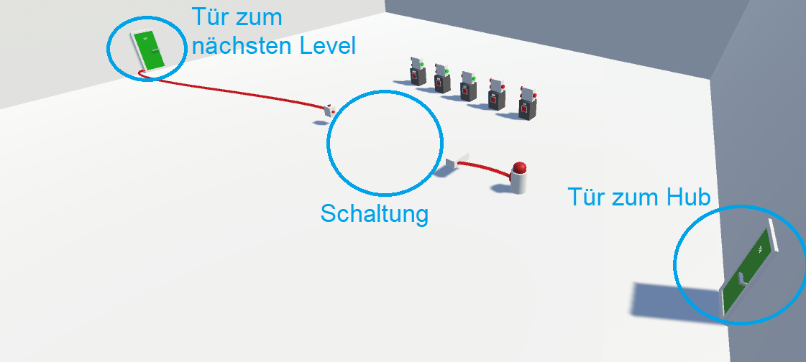
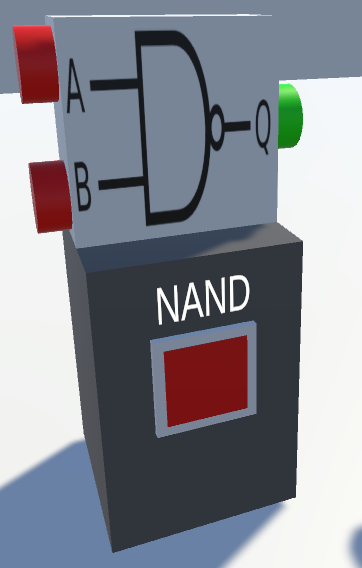

# TILab VR
TILab VR ist ein Logik-Simulator und Learning Tool in VR. Das Tool ist angelehnt an das Labor im Fach "Technische Informatik" in den Bachelor-Informatikstudiengängen. Ziel ist es, Wissen über boolsche Algebra, sowie die Funktion von Logischen Gattern und Schaltungen zu vermitteln.
Die Nutzer können verschiedene Aufgaben ( "Levels" ) absolvieren, in denen sie eigene Schaltungen entwerfen müssen.
Es gibt auch einen Sandbox-Modus, in dem frei Schaltungen entworfen werden können.

# Steuerung
- **Grip**: Objekte greifen und bewegen (hold)
- **Trigger**: Schalter und Türen bedienen (klick) , Kabel ziehen (hold)
- **Trackpad**: Teleport
- **Function**: Kabel/Gatter löschen

# Wie funktioniert die Anwendung?
Der Nutzer startet im Hub-Level. Hier befinden sich mehrere Türen, die zu den einzelnen Levels führen. Durch Interaktion mit der Tür (**Trigger**) kommt der Nutzer in das entsprechende Level. Jedes Level enthält eine Aufgabe, die es zu lösen gilt. Vom *Hub* aus kann der Nutzer auch ein *Sandbox*-Level betreten, bei dem alle Bausteine zur Verfügung stehen und frei Schaltungen entworfen werden können.

## Level
Die Level haben eine Reihenfolge. Nach Abschluss des Levels aktiviert sich eine grüne Tür, die mit der Schaltung verbunden ist. Diese Tür führt zum nächsten Level. Jedes Level beinhaltet ebenfalls eine Tür, die zurück zum *Hub* führt.

Über der Tür zum nächsten Level ist eine Wahrheitstabelle, die die zu entwerfende Schaltung beschreibt. An den Wänden des Level-Raums sind die Aufgabenstellung, Hinweise zur Steuerung und weitere nützliche Informationen beschrieben.

Jedes Level enthält einen *Generator*-Baustein, der die Eingabesignale generiert, und einen *Validator*-Baustein, der die Ausgabesignale der Schaltung überprüft. Die Schaltung muss also zwischen diesen beiden Bausteinen aufgebaut werden und diese so miteinander verknüpfen, dass beim *Validator*-Baustein die geforderte Bitfolge ankommt. 

Der *Generator* ist mit einem Button verknüpft. Wird dieser mit **Trigger** gedrückt, spielt der Generator die vorgegebene Reihe an Eingaben durch.

Akzeptiert der Validator die Ausgabe der Schaltung, wird die Tür zum nächsten Level freigeschaltet.

## Gatter
Gatter können vom Nutzer mit **Grip** aufgenommen und bewegt werden. Je nach Aufgabe sind in einem Level verschiedene Gatter verfügbar. In jedem Level befindet sich eine Reihe mit *Gate Spawner* Objekten. Beim Start des Levels wird automatisch von jedem *Spawner* ein entsprechendes Gatter erzeugt, weitere Gatter können über den roten Button angefordert werden. Der Nutzer kann die Gatter einfach von der Auflagefläche des *Spawner* herunternehmen. 

Nicht benötigte Gatter können mit **Function** gelöscht werden.

## Kabel

Zwischen den Pins der Gatter können Nutzer mit **Trigger** Verbindungskabel ziehen. Die Kabel zeigen farblich ihren Zustand an: rote Kabel übertragen gerade logisch 0, grüne Kabel übertragen gerade logisch 1.

Nicht benötigte Kabel können mit **Function** gelöscht werden.

Autoren: Maurice Didion, Julian Paulus, Lucas Reinhard